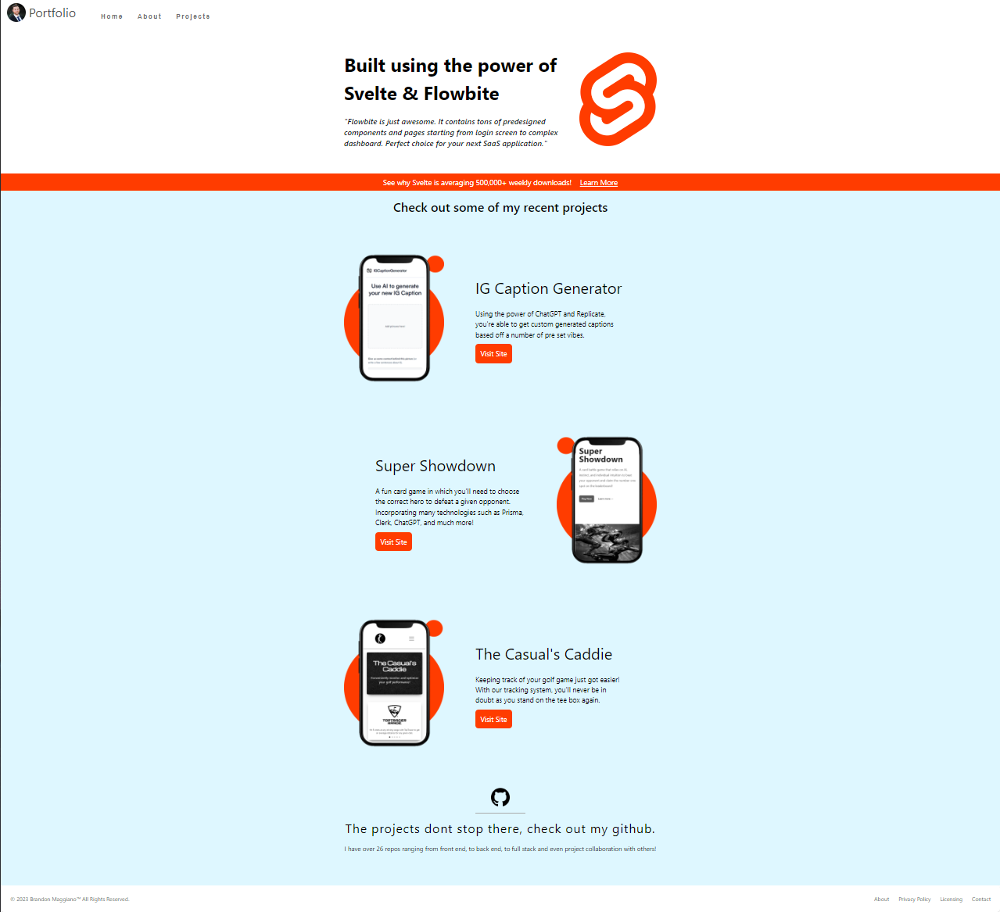

# Svelte Portfolio

## Link to deployed app

https://svelte-portfolio-kappa.vercel.app/

## Description

Svelte is a fast growing front-end framework that rivals the intuitiveness and ease of use of React and NextJs. This portfolio was made with the decision to replicate Mint.com's UI/UX experience and I feel like I knocked it out of the park. We use very simple and basic design patterns and color choices to keep the user engaged with different sections, as well as have very similar UI concepts to that of Mint's website. You're able to check out my recent projects, a little about myself, and also a list of a good chunk of my projects. As Svelte grows in popularity, I think it's your duty as a front-end developer to be at least somewhat familiar with how it works.

## Screenshot

## License

MIT License

Copyright (c) 2023 Brandon Maggiano

Permission is hereby granted, free of charge, to any person obtaining a copy of this software and associated documentation files (the "Software"), to deal in the Software without restriction, including without limitation the rights to use, copy, modify, merge, publish, distribute, sublicense, and/or sell copies of the Software, and to permit persons to whom the Software is furnished to do so, subject to the following conditions:

The above copyright notice and this permission notice shall be included in all copies or substantial portions of the Software.

THE SOFTWARE IS PROVIDED "AS IS", WITHOUT WARRANTY OF ANY KIND, EXPRESS OR IMPLIED, INCLUDING BUT NOT LIMITED TO THE WARRANTIES OF MERCHANTABILITY, FITNESS FOR A PARTICULAR PURPOSE AND NONINFRINGEMENT. IN NO EVENT SHALL THE AUTHORS OR COPYRIGHT HOLDERS BE LIABLE FOR ANY CLAIM, DAMAGES OR OTHER LIABILITY, WHETHER IN AN ACTION OF CONTRACT, TORT OR OTHERWISE, ARISING FROM, OUT OF OR IN CONNECTION WITH THE SOFTWARE OR THE USE OR OTHER DEALINGS IN THE SOFTWARE.
